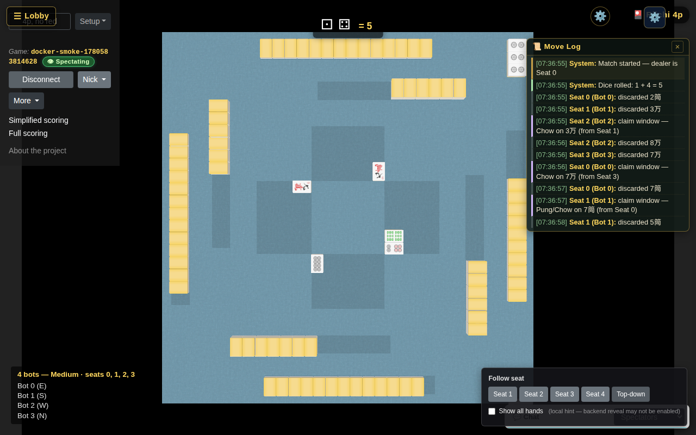

# Mahjong Autotable (Changsha-first)

> 📖 See [STATE-OF-GAME.md](./STATE-OF-GAME.md) for proven game state and deploy guide.

Changsha-style 4-player Mahjong, forked from
[`pwmarcz/autotable`](https://github.com/pwmarcz/autotable) — a 3D
tabletop renderer with WebGL tiles, dice, and physics. This fork adds
a server-authoritative Changsha rules engine, persistence, scoring,
bots, replay/audit, and a single Docker image for self-hosting.



> *Real Changsha game running inside the single-image Docker
> container — 4 bots, dice rolled, discards and Chow/Pung claims live
> in the move log.* (Captured by
> `playtest-artifacts/playtest-docker-smoke.spec.mjs`.)

## Quickstart

| I want to…                                        | Use this                                                                                  |
|---------------------------------------------------|-------------------------------------------------------------------------------------------|
| **Build a Linux Docker image**                    | `./build.sh` or `./build.ps1` (Docker/Buildx only; no host Node/.NET, no deployment) |
| **Play locally** (one terminal)                   | `./scripts/compose-bootstrap.sh` (one-time JWT key → gitignored `.env`), then `docker compose up -d --build` and open `http://127.0.0.1:8950/autotable/` |
| **Develop in VS Code** with hot reload            | Open the repo, press **F5**, select `F5 Full Stack (Backend + Autotable)`                 |
| **Deploy to my Linux server** (single image)      | See [Docker single-image deploy](#docker-single-image-deploy) below                       |
| **Run with Postgres instead of SQLite**           | See [Postgres swap](#postgres-swap) below                                                 |

## Structure

```text
src/
  backend/
    Mahjong.Autotable.slnx
    src/Mahjong.Autotable.Api/      # .NET 10 minimal API + static hosting + Changsha runtime
    tests/                          # xUnit suites (~5,200 tests across Players / Changsha / Autotable)
  frontend/
    autotable-src/                  # TypeScript + Three.js source (Vite-built)
    autotable/                      # built bundle (regenerated by `npm run build`)
.vscode/
  launch.json                       # F5 compounds for local dev
  tasks.json                        # backend/frontend tasks
Dockerfile                          # single-image deploy (frontend + backend)
build.sh / build.ps1                 # build and load a Linux image; optional archive
docker-compose.yml                  # local-dev compose (SQLite volume)
docker-compose.postgres.yml         # overlay adding a Postgres 16 sidecar
infra/
  docker/                           # legacy Dockerfile kept for compose references
docs/
  docker.md                         # Docker quickstart
  deployment.md                     # Full deploy runbook (env vars, healthchecks, backups, troubleshooting)
```

## Local development (VS Code F5)

> Stephen's original requirement: *"I should be able to build + run
> the backend and frontend with VS Code by just hitting F5. Local dev
> should be easy."*

1. Open `mahjong-autotable.code-workspace` (or the repo folder).
2. Press **F5** and pick `F5 Full Stack (Backend + Autotable)` — the
   default compound.
3. VS Code runs:
   - `.NET Backend` — `dotnet run` on
     `src/backend/src/Mahjong.Autotable.Api` (listens on
     `http://localhost:5000` / `https://localhost:7135` per
     `launchSettings.json`).
   - `Autotable (Vite watch)` — rebuilds the frontend bundle
     into `src/frontend/autotable/` on save.
4. The `serverReadyAction` opens the browser at `/autotable/`
   automatically when the backend reports `Now listening on …`.

Other launch configs in `.vscode/launch.json`:

- `.NET Backend` — backend only (no frontend rebuild).
- `Backend + Autotable Baseline` — backend only, opens `/autotable/`.
- `Autotable (Vite watch)` — frontend watcher only.

CLI equivalents:

```bash
# Backend
dotnet run --project src/backend/src/Mahjong.Autotable.Api/Mahjong.Autotable.Api.csproj

# Frontend (watch mode)
cd src/frontend/autotable-src
npm install
npm run watch     # or: npm run build for a one-shot
```

## Docker single-image deploy

> Stephen's original requirement: *"The frontend and backend should
> be packageable as a single docker image so that I can run in a
> container on my Linux server that I already have."*

The repo-root `Dockerfile` is a 3-stage build:

1. **frontend-build** — `node:20-alpine` runs `npm ci` and
   `npm run build` (Vite) → static bundle in `/src/frontend/autotable/`.
2. **backend-build** — `mcr.microsoft.com/dotnet/sdk:10.0` restores
   and publishes the API as a framework-dependent app.
3. **runtime** — `mcr.microsoft.com/dotnet/aspnet:10.0` hosts the
   API and serves the bundled frontend from the same process. Runs
   as non-root UID 1000, persists SQLite on `/data` volume, has a
   `HEALTHCHECK` against `/health`, and signals cleanly via `tini`.

### One-command image build

```bash
./build.sh
```

Or from PowerShell:

```powershell
./build.ps1
```

Both build from source through the root Dockerfile and load
`mahjong-autotable:local` into Docker. They work from another working
directory and paths containing spaces, propagate failures, and never start
containers or push to a registry. The default platform is `linux/amd64`;
use `--platform linux/arm64` / `-Platform linux/arm64` for an ARM64 server.
Docker must support building the selected platform.

To transfer the image to a Linux server without a registry:

```bash
./build.sh --archive mahjong-autotable.tar
# PowerShell equivalent: ./build.ps1 -Archive mahjong-autotable.tar
# Transfer the archive and this repo's Compose/bootstrap files, then on Linux:
docker load --input mahjong-autotable.tar
```

Archive export is opt-in and refuses to overwrite an existing file. See
[Docker quickstart](docs/docker.md) for tag/platform options and examples.

### Run with Compose

The image runs in `Production` posture, which refuses to boot without a
stable JWT signing key. The one-time bootstrap writes a key into a local
`.env` (gitignored — no secret is ever committed); it is **idempotent**, so
re-running it keeps the existing key stable across restarts:

```bash
./scripts/compose-bootstrap.sh        # first run writes a JWT key to .env
docker compose up -d --no-build       # use the image built/loaded above
curl --fail http://127.0.0.1:8950/health
```

Open `http://127.0.0.1:8950/autotable/`. Alternatively,
`docker compose up -d --build` builds and starts from source.
Container port **8080 stays fixed**. Set `MAHJONG_HOST_PORT` to remap the host
port, and `MAHJONG_BIND_ADDRESS=0.0.0.0` only if direct network access is
intended. Loopback is the default for a host Nginx reverse proxy.

If `JWT_SIGNING_KEY` is missing, `docker compose up` fails fast with a
one-line fix instruction instead of crash-looping. Keep the key stable:
regenerating it invalidates prior signed identities/tokens. Do not commit
`.env`, pass the key as a build argument, or print resolved Compose
configuration containing secrets.

Compose generates project-scoped container and volume names; it no longer
uses a globally fixed `container_name`. Keep the same project name and
environment file across updates to preserve the database/key. An isolated
second instance can use a separate env file, `-p` name, and host port:

```bash
./scripts/compose-bootstrap.sh --env-file ./.env.smoke.local
MAHJONG_HOST_PORT=8951 docker compose --env-file ./.env.smoke.local \
    -p mahjong-smoke up -d --no-build
```

Use a gitignored private env-file location such as `.env.smoke.local`.
`docker compose down` retains the project's database volume;
`docker compose down -v` destroys it. See the
[Nginx HTTP/WebSocket guide](docs/reverse-proxy.md) for the matching upstream.

### Postgres swap

To run with Postgres 16 instead of SQLite (the `mahjong` service inherits
the base Production posture, so run the same bootstrap first):

```bash
./scripts/compose-bootstrap.sh
docker compose -f docker-compose.yml -f docker-compose.postgres.yml up -d --build
```

`docker-compose.postgres.yml` spins up a `postgres:16-alpine` sidecar,
flips `Persistence__Provider=Postgres`, and waits on the DB's
`pg_isready` healthcheck before booting the API. Default credentials
(`mahjong/mahjong/mahjong_autotable`) are dev-only — override
`POSTGRES_PASSWORD` for anything that touches real users.

### Deeper references

- **Docker quickstart:** [`docs/docker.md`](docs/docker.md)
- **Full runbook (env vars, healthchecks, backups, troubleshooting,
  production updates):** [`docs/deployment.md`](docs/deployment.md)
- **Database providers:** [`docs/database-providers.md`](docs/database-providers.md)

## Architecture (high level)

- **Frontend:** TypeScript + Three.js renderer (forked from
  pwmarcz/autotable), built with Vite, hosted as static assets by
  the backend.
- **Backend:** .NET 10 minimal API. EF Core with a provider switch
  (`Sqlite` default, `Postgres`, `SqlServer`). WebSocket relay at
  `/ws/autotable` for real-time multiplayer; SignalR hub at
  `/hubs/changsha` for the server-authoritative Changsha runtime.
- **Runtime:** `ChangshaGameRuntime` owns hand/wall state and
  validates every move against a deterministic state machine.
  Bot decisions are driven by `ChangshaBotEngine`. Persistence
  snapshots state on every mutation with optimistic concurrency
  (`StateVersion`).
- **Observability:** `/health` returns DB connectivity, EF migration
  count, active game count, OAuth provider status, build SHA, and
  process uptime — wired into the Docker `HEALTHCHECK`.

See [`docs/architecture.md`](docs/architecture.md) for module
breakdown with LOC counts.

## Backend foundation

- .NET 10 minimal API at `src/backend/src/Mahjong.Autotable.Api`.
- EF Core wired with provider switch:
  - `Sqlite` (default)
  - `PostgreSql`
  - `SqlServer`
- Server-authoritative Changsha runtime in
  `src/backend/src/Mahjong.Autotable.Api/Changsha/` owns wall, hands,
  melds, claim windows, and scoring. State is persisted on every
  mutation with optimistic concurrency (`StateVersion`).
- WebSocket transport at `/ws/autotable` (relay + Changsha) and
  SignalR hub at `/hubs/changsha` for the canonical Changsha
  multiplayer flow. Bot decisions drive through
  `ChangshaBotEngine` with safe-default fallbacks on timeout.
- See [`docs/architecture.md`](docs/architecture.md) for the
  authoritative module breakdown.

Key config (`appsettings.json`):

- `Persistence:Provider`
- `ConnectionStrings:Sqlite`
- `ConnectionStrings:PostgreSql`
- `ConnectionStrings:SqlServer`
- `Authentication:JwtSigningKeys` (set for production — see
  [`docs/jwt-rotation.md`](docs/jwt-rotation.md))

## Known limitations

See [`docs/known-limitations.md`](docs/known-limitations.md) for the
current list (V2 rules gaps, single-game-per-instance pin on relay
variants, etc.).
