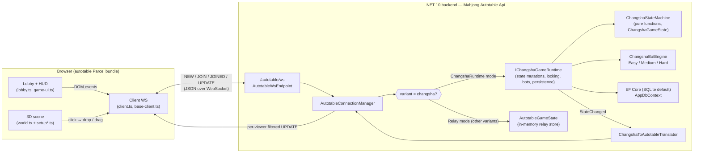

# Mahjong Autotable — Architecture

> Engineering reference for `long2know/mahjong-autotable`. Reflects the codebase
> as of Phase G (commit `730946c`, branch `stlong/phase-h-wave-1-stability-polish`).

The project is a **Changsha-first Mahjong table** built on top of a vendored
fork of [`pwmarcz/autotable`](https://github.com/pwmarcz/autotable). It ships
as a single .NET process that serves both the WebSocket game endpoint and the
3D web client; the client is the upstream autotable Parcel bundle with
Changsha-specific extensions grafted on.

This document explains how those parts fit together — for new contributors, for
reviewers verifying scope boundaries, and for AI agents coordinating multi-wave
work.

---

## 1. High-level diagram



The two-mode duality (`ChangshaRuntime` vs `Relay`) is the central
architectural decision — see §4 for why.

---

## 2. Backend layout (`src/backend/src/Mahjong.Autotable.Api/`)

| Folder | Purpose | Key files |
|---|---|---|
| `Autotable/` | WebSocket protocol + the relay/runtime split that drives the upstream bundle. | `AutotableWsEndpoint.cs` (~1,056 LOC — endpoint + connection manager + RuntimeMode enum), `AutotableProtocol.cs` (NEW/JOIN/JOINED/UPDATE wire types), `AutotableGameState.cs` (in-memory relay store for non-Changsha variants), `AutotableSlotMap.cs` (3D slot-name ↔ tile-id mapping), `ChangshaToAutotableTranslator.cs` (Changsha state → wire entries) |
| `Changsha/` | Changsha rules engine. Pure-function state machine, runtime wrapper, bot engine, claim adjudicator, scoring. | `ChangshaDomain.cs` (DTOs, enums incl. `ChangshaPhase` and `WinPattern`), `ChangshaStateMachine.cs` (~1,073 LOC — RollDice, TakeTilesFromWall, Discard, ResolveClaim, PassClaim …), `WinDetector.cs` (258-pair, SevenPairs, AllPungs, FullFlush), `ScoringService.cs` (V1 payment table), `ClaimAdjudicator.cs`, `DealService.cs`, `BreakPointService.cs`, `DiceService.cs` |
| `Changsha/Runtime/` | Async wrapper around the state machine. Holds per-game locks, schedules bots, persists snapshots, fires `StateChanged`. | `ChangshaGameRuntime.cs` (~1,543 LOC — `IChangshaGameRuntime` API + scheduler), `ChangshaGameInstance.cs` (per-game state + `SemaphoreSlim` lock + lifecycle cancellation), `ChangshaRuntimeOptions.cs` (timing knobs) |
| `Changsha/Bot/` | Three-tier bot engine (Phase F). Stateless strategies behind `IChangshaBotStrategy`. | `ChangshaBotEngine.cs` (singleton resolver, `Resolve("easy"|"medium"|"hard")` → strategy), `EasyStrategy.cs`, `MediumStrategy.cs` (port of legacy `ChangshaBotPolicy`), `HardStrategy.cs` (EV-aware with shanten lookahead), `HandEvaluator.cs` (`MinShantenToHu`, `CountLooseTiles`), `IChangshaBotStrategy.cs` |
| `Persistence/` | EF Core provider switching for SQLite / PostgreSQL / SQL Server. | `PersistenceOptions.cs`, `PersistenceProvider.cs`, `ServiceCollectionExtensions.cs` |
| `Data/` | EF Core `AppDbContext`, entity types, raw-SQL bootstrapper for schema-on-first-run. | `AppDbContext.cs`, `DatabaseBootstrapper.cs`, `Entities/ChangshaEntities.cs` |
| `Tables/` | Shared types for the legacy SignalR hub path + shared exceptions (`TableRuleException`, `TableClaimType`). The legacy `/api/tables/*` REST surface was deleted in Phase A. | `TableRuleException.cs`, claim-type enums |
| `Program.cs` | DI registration + middleware pipeline + endpoint mapping. ~90 LOC. | — |
| `wwwroot/` | Static assets. The bundled Parcel output is mounted from `../../../frontend/autotable` via `PhysicalFileProvider` at `/autotable` (see `Program.cs:51-69`). | — |

### Program.cs hot path

1. `AddPersistence` registers the configured EF Core provider (default SQLite at `data/mahjong-autotable.db`).
2. `AddSignalR` keeps the legacy `/hubs/changsha` SignalR endpoint alive for the Phase 1–2 React UI era — currently unused by the autotable bundle but preserved for tests and possible future client work.
3. `AddSingleton<IChangshaGameRuntime, ChangshaGameRuntime>` — one runtime per process, owning all in-memory Changsha games.
4. `AddSingleton<AutotableConnectionManager>` — the WS connection registry.
5. `app.UseWebSockets()` enables raw WebSockets (distinct from SignalR's transport).
6. `app.MapAutotableWs()` mounts `GET /autotable/ws` with the upstream-protocol handler.
7. Static-file middleware serves the Parcel build directory at `/autotable/`.

The result: a fresh `dotnet run` exposes `http://localhost:5114/autotable/` as a
playable URL with the bundle auto-connecting back to `/autotable/ws`.

---

## 3. Frontend layout (`src/frontend/autotable-src/`)

The frontend is a vendored in-tree fork of `pwmarcz/autotable`, modified for
Changsha. Build output lands in `src/frontend/autotable/` (the dist directory,
served by the backend); source lives in `src/frontend/autotable-src/`.

Tooling: **Parcel 2.15** (TypeScript + HTML + CSS). No React. No bundler
migration was performed — Phase A deleted the parallel React/Vite app.

| File | Role |
|---|---|
| `index.html` | Single-page shell. Contains the 3D `<canvas>`, the sidebar HUD, the lobby panel (`#lobby-panel`), the about page link, and Parcel entry tags. |
| `index.ts` | Boot script. Resolves `gameId`/`viewerSeat` from URL params and instantiates `Game`. |
| `main-view.ts` | Top-level page lifecycle: creates the `Client`, `World`, `GameUi`, and lobby controller. |
| `client.ts` | Typed WS protocol surface. Declares the collections (`match`, `seats`, `things`, `nicks`, `mouse`, `sound`, `dice`, `claim`, `result`, `pickup`). |
| `base-client.ts` | Generic Collection / WS / replay primitives shared with upstream. |
| `world.ts` (~847 LOC) | Three.js scene graph. Owns the table mesh, lighting, camera, raycast pickers, animation loop. |
| `setup.ts` (~365 LOC) | Variant-aware setup pipeline. Builds tile catalogue (108 tiles for Changsha, 136 for upstream variants — see `setup.ts:46`) and slot positions for each tile in the 3D scene. |
| `setup-deal.ts` (~243 LOC) | Deal-shape generator. 14/14/13/13 wall split for Changsha (see `setup-deal.ts:22`); standard 17-stack walls for upstream variants. |
| `setup-slots.ts` | Per-seat hand / discard / meld slot generation. |
| `lobby.ts` (~211 LOC, Phase G) | Sidebar lobby picker — variant / dealMode / botCount / botDifficulty. URL is the source of truth; the lobby writes a query-string and `location.replace`s. |
| `game-ui.ts` (~1,004 LOC) | All non-3D UI: scoring panel, claim window, dice roller, pickup affordance, win panel, sidebar status, debug overlay. |
| `client-ui.ts` | Mouse/keyboard input binding into `world.ts`. |
| `thing.ts`, `thing-group.ts`, `slot.ts` | Tile + slot abstractions (one `Thing` per physical tile, one `ThingGroup` per claim/meld). |
| `mouse-ui.ts`, `mouse-tracker.ts`, `movement.ts` | Drag/select/drop physics for tiles in 3D. |
| `selection-box.ts`, `center.ts`, `object-view.ts` | Visual helpers (selection halo, table centerpiece, debug viewer). |
| `asset-loader.ts` | Texture + glTF loading with auto-mipmap. |
| `sound-player.ts` | Tile click / discard sound playback (deduplicated via the `sound` collection). |
| `style.css` | All UI styling. Brass-gold accents on dark semi-opaque panels (Phase G lobby aesthetic). |
| `types.ts` | Wire-typed entry shapes shared by `client.ts` and `game-ui.ts`. |

### Bundle output

`src/frontend/autotable/` contains the Parcel build output (hashed filenames
like `autotable-src.33f97fad.js`, `autotable-src.7934372e.css`, plus tile-set
images, audio, and the glTF table model). The backend serves this directory
verbatim from `/autotable/`.

---

## 4. Variant mode switch (Phase F / Phase G)

The endpoint runs in one of two modes per connection, decided at handshake
time from the `?variant=` query parameter:

```csharp
// AutotableWsEndpoint.cs:975
public enum AutotableRuntimeMode { Relay = 0, ChangshaRuntime = 1 }

// AutotableConnection — derived from ?variant=
public AutotableRuntimeMode RuntimeMode =>
    string.Equals(Variant, "changsha", StringComparison.OrdinalIgnoreCase)
        ? AutotableRuntimeMode.ChangshaRuntime
        : AutotableRuntimeMode.Relay;
```

**Why two modes?** Upstream `pwmarcz/autotable` implements four variants
(`four_player`, `three_player`, `bamboo`, `minefield`) entirely in the
client bundle's `setup.ts`. The original server is a pure relay — it forwards
client UPDATEs to other connections without ever interpreting them.

Changsha is different: the server is **authoritative** over wall composition,
deal flow, claim resolution, scoring, and bot decisions. We preserve upstream
parity by routing non-Changsha variants through the relay path (Phase C
behaviour) and only binding the Changsha runtime when `?variant=changsha`.

| Connection variant | Mode | Server behaviour |
|---|---|---|
| `?variant=changsha` (default) | `ChangshaRuntime` | On first seat-take, lazily creates a `ChangshaGameInstance`. Subsequent UPDATEs from the client are validated; runtime emits authoritative state via `StateChanged` → translator → connection manager. |
| `?variant=four_player` (or `three_player` / `bamboo` / `minefield`) | `Relay` | Server forwards bundle UPDATEs verbatim to other connections sharing the same `gameId`. No rules engine bound. |

This routing is per-connection but per-game. Connections sharing a `gameId`
may legitimately run in different modes (a Relay-mode bundle observing a
Changsha game — used in tests). Runtime binding is owned exclusively by
Changsha-mode connections; Relay-mode connections never trigger a runtime
allocation.

The query parameters Phase F locks (`AutotableWsEndpoint.cs:150-181`):
`variant`, `dealMode` (manual|auto), `botCount` (0..3), `botDifficulty`
(Easy|Medium|Hard). Phase G's sidebar lobby (`lobby.ts`) is a one-way bridge
that writes these to the URL before the bundle initialises.

---

## 5. Manual-pickup state machine (Phase F)

The original autotable bundle implements the deal as a one-shot animation: on
"Deal", every tile teleports to its dealt position. For Changsha, this skips
the canonical pickup flow that Chinese players expect — dice roll, wall break,
round-robin 4×3 pickups, single tile, dealer extra.

Phase F introduced six new values in `ChangshaPhase` (declared at
`ChangshaDomain.cs:118-144`) that graft a sub-state machine between
`RollingDice` and `AwaitingDiscard`:

```
RollingDice
  → BreakPointMarked   (dice rolled, wall break index computed,
                        waiting for first pickup)
  → PickupRound1       (each seat takes 4 — cursor rotates clockwise
                        starting from dealer; cumulative = 4 per seat)
  → PickupRound2       (each seat takes 4 — cumulative = 8)
  → PickupRound3       (each seat takes 4 — cumulative = 12)
  → SingleTilePickup   (each seat takes 1  — cumulative = 13)
  → DealerExtra        (dealer takes 14th — must discard next)
  → AwaitingDiscard    (normal turn flow resumes)
```

Each transition is driven by a `TakeTilesFromWall(seatIndex, count)` call,
validated by the state machine against `PickupSeatIndex` (the current cursor)
and `ExpectedPickupCount(phase)` (the canonical batch size).

Two deal modes coexist (`ChangshaDomain.cs:153-159`):
- `DealMode.Auto` — legacy one-shot path (`Deal()` deposits 14/13/13/13
  atomically). Skips all six new phases. Default for non-WS tests and the
  `?dealMode=auto` query.
- `DealMode.Manual` — drives the pickup state machine. Default for Changsha
  via the WS endpoint and the lobby picker.

Both converge in identical post-pickup state; downstream logic (claims,
scoring, banker rotation) is dealMode-agnostic.

Bots participate in the manual flow via `ChangshaGameRuntime.RunBotPickupAsync`
(Phase G) — when `PickupSeatIndex` is a bot, a 500ms-delayed `TakeTilesFromWall`
call advances the cursor automatically; otherwise the runtime waits for a human
`pickup.take` UPDATE.

The corresponding client surface is the singleton `pickup` collection
(`client.ts:32-44`): the server pushes `["pickup", 0, { phase, seatIndex, count,
dealMode, breakPoint, wallIndex }]` and the client posts back
`["pickup", "rollDice", ...]` or `["pickup", "take", ...]`.

---

## 6. Bot engine (three tiers)

`IChangshaBotStrategy` (`Changsha/Bot/IChangshaBotStrategy.cs`) defines four
phase hooks plus a unified entry:

```csharp
public interface IChangshaBotStrategy {
    string Difficulty { get; }
    BotAction OnTurnStart(ChangshaGameState state, int botSeatIndex);
    BotAction OnOtherDiscard(ChangshaGameState state, int botSeatIndex, int discarderSeat, int discardedTileId);
    BotAction OnSelfDraw(ChangshaGameState state, int botSeatIndex);
    BotAction OnPickupCue(ChangshaGameState state, int botSeatIndex);
    BotAction DecideAction(ChangshaGameState state, int botSeatIndex);  // routes to one of the above
}
```

| Tier | Behaviour | Use case |
|---|---|---|
| **Easy** | Discards the highest-rank unpaired tile. Only ever claims Hu and obvious Pungs. Zero shanten awareness. | New-player tutorials, demos. |
| **Medium** | Port of the legacy `ChangshaBotPolicy`: scores each tile by "keepability" (pairs + adjacencies + 2/5/8 bias) and claims Hu / Pung / Kong, plus Chow when below 3 melds. | **Default** — balanced single-player. |
| **Hard** | Adds defensive penalties for tiles recently discarded by opponents, plus shanten lookahead via `HandEvaluator.MinShantenToHu` (a coarse but monotonic estimator). Claims Chow only when it strictly improves shanten. | "Real-game" feel against humans. |

The resolver (`ChangshaBotEngine.Resolve`) is a static singleton — strategies
are stateless across hands, so allocations are zero on the hot path. Unknown
or null difficulty strings fall back to Medium.

**Wave 1 (current) work** adds a `BotDecisionTimeoutMs` ceiling. If a strategy
exceeds it (a real risk for the Hard-tier EV depth), the runtime falls back to
a safe default action: `Pass` in a claim window, `ChangshaBotPolicy.SelectDiscardTile`
on the bot's own turn. See `.squad/decisions/inbox/ripley-phase-h-design.md` §1.2.

---

## 7. Persistence

EF Core 10 with provider switching via configuration:

```jsonc
// appsettings.json
"Persistence": { "Provider": "Sqlite" }   // or "PostgreSql" / "SqlServer"
```

`Persistence/ServiceCollectionExtensions.AddPersistence` binds the correct
provider package and points `AppDbContext` at the configured connection
string. SQLite is the default; the database file lives at `data/mahjong-autotable.db`
relative to the API content root. On first run, `DatabaseBootstrapper`
materialises the schema with raw SQL (`Data/DatabaseBootstrapper.cs`) — chosen
over migrations to keep the developer onboarding to `dotnet run`.

`ChangshaGameRuntime` writes a `ChangshaGameSnapshot` (gameId, state-version,
serialised state JSON) after every applied state transition (gated by
`ChangshaRuntimeOptions.PersistSnapshots = true`). Persistence is fire-and-forget
on the runtime hot path: snapshot writes never block the WS broadcast.

Crash recovery (hydration on restart) and replay-integrity verification are
listed in `docs/known-limitations.md` as Phase I+ scope.

---

## 8. Local dev (F5)

The repo ships a one-key full-stack F5 launch:

```jsonc
// .vscode/launch.json — compound "F5 Full Stack (Backend + Autotable)"
{
  "configurations": ["F5 Full Stack (Backend + Autotable)"]
}
```

This compound launches two configurations in parallel:
1. **`.NET Backend`** — runs `dotnet run` on the API project. PATH is augmented
   with `$HOME/.dotnet` so manual .NET 10 installs are picked up (PRs #27/#28).
2. **`Autotable (Parcel watch)`** — a node-terminal task running
   `npx parcel watch index.html about.html --public-url . --no-source-maps --dist-dir ../autotable`
   from `src/frontend/autotable-src/`. Parcel writes incrementally to
   `src/frontend/autotable/`, which the backend serves verbatim.

First-time setup is a one-time `dotnet restore` + a one-time `npm install`
inside `src/frontend/autotable-src/`. After that, F5 opens `http://localhost:5114/autotable/`
in the default browser via `serverReadyAction`.

---

## 9. Docker

Single-image deployment via `infra/docker/Dockerfile`. The Dockerfile defines
two runtime stages:

| Stage | Contents | Image purpose |
|---|---|---|
| `runtime-autotable` (current production target) | .NET 10 ASP.NET runtime + published API + the Parcel build at `wwwroot/autotable/`. | Single-image autotable deployment. |
| `runtime-modern` (vestigial, kept for future React reintroduction) | Same plus the Vite-built React SPA at `wwwroot/`. | Reserved for a possible Phase I+ React reintroduction. |

Build command:

```bash
docker build -f infra/docker/Dockerfile -t mahjong-autotable:latest --target runtime-autotable .
docker run --rm -p 8080:8080 mahjong-autotable:latest
# → http://localhost:8080/autotable/
```

The image exposes `8080`; `ASPNETCORE_URLS=http://+:8080` is baked in. SQLite
is the default persistence (file inside the container — mount a volume at
`/app/data` to persist across container restarts).

---

## 10. Scope boundaries (for multi-agent contributors)

| Agent | Owns | Read-only for |
|---|---|---|
| **Bishop** | All `src/backend/src/Mahjong.Autotable.Api/**` production code. | Test code, frontend, docs. |
| **Vasquez** | All `src/backend/tests/**` test code. | Production code, frontend, docs (except `docs/rules/changsha-spec.md`, which she co-owns with Ripley). |
| **Hicks** | All `src/frontend/autotable-src/**` source + the regenerated Parcel build at `src/frontend/autotable/**`. | Backend, tests, docs. |
| **Ripley** | Architecture docs (`docs/architecture.md`, `docs/known-limitations.md`), design memos in `.squad/decisions/inbox/`. Updates `.squad/agents/ripley/history.md`. | All production / test / frontend code. |
| **Hudson** | Test scaffolding cross-cutting QA work (Phase 5a frontend test pack era). Currently dormant. | All production code. |

Wave-level scope locks are enumerated explicitly in each Ripley design memo
(see e.g. `.squad/decisions/inbox/ripley-phase-h-design.md` §1.3 and §2.4).

---

## 11. Further reading

- `docs/rules/changsha-spec.md` — canonical Changsha rules (~743 lines).
- `docs/known-limitations.md` — known V1 gaps.
- `.squad/decisions.md` — append-only team decisions log (1,839 lines after the Phase G sweep).
- `.squad/decisions/inbox/ripley-phase-f-design.md` — the full 955-line Phase F design.
- `.squad/agents/ripley/history.md` — Lead's running notes per phase.
